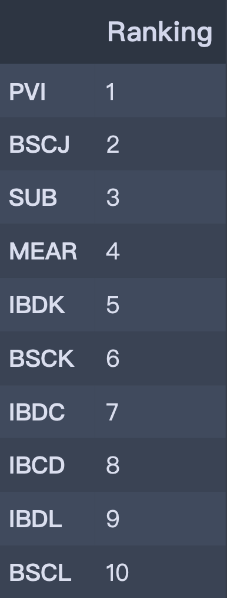

### ETF

​	'PVI', 'MEAR', 'BSCJ', 'IBDC', 'IBDK', 'IBCD', 'IBDL', 'SUB', 'BSCK',

​	'IBDM', 'BSCL', 'PRB', 'SHM', 'SMMU', 'BSCM', 'IBDN', 'IBDD', 'BSCN',

​	'IBCE', 'IBDO', 'BSCO', 'SMB', 'IBDP', 'IBDQ', 'MUNI', 'BSCP', 'VTEB',

 	'FMB', 'MUB', 'PZA', 'TFI', 'SHYD', 'ITM', 'RVNU', 'MLN'

​	原先有53筆ETF，但將少於三年資料的ETF去除，剩35筆

### 資料來源  && 爬蟲套件

- yahoo finance
- from selenium import webdriver

### 指標類型

1. Sharpe ratio
2. Omega
3. Riskiness

### 週資料分析

|                        **Riskiness**                         |                            Omega                             |                            ASKSR                             |
| :----------------------------------------------------------: | :----------------------------------------------------------: | :----------------------------------------------------------: |
|  |  |  |

### 月資料分析

|                          Riskiness                           |                            Omega                             |                            ASKSR                             |
| :----------------------------------------------------------: | :----------------------------------------------------------: | :----------------------------------------------------------: |
|  |  |  |

### Discussion

1. ##### 週資料或月資料結果評比相似嗎?

   - 週資料與月資料雖排名稍有不同，但總體來看是相似的。

2. ##### 不同指標評比結果相似嗎?

   -  觀察下，riskiness和ASKSR是比較相似的，Omega和另外兩者是比較相反的。

